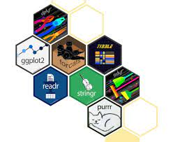
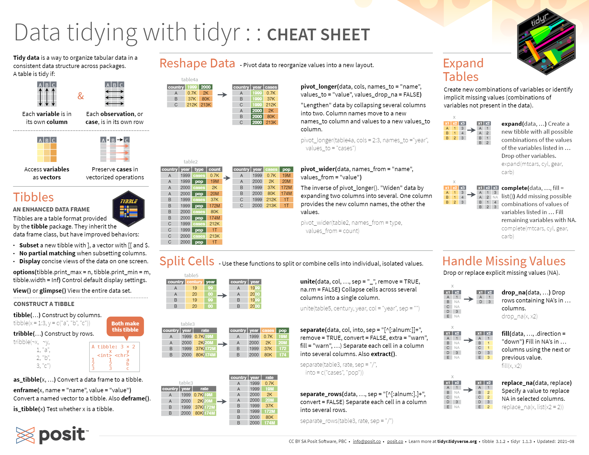
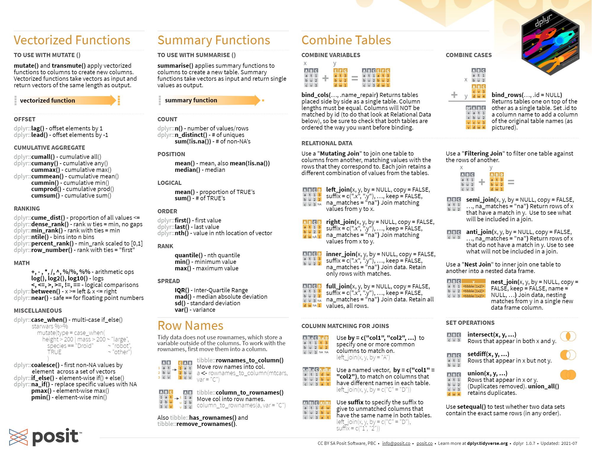
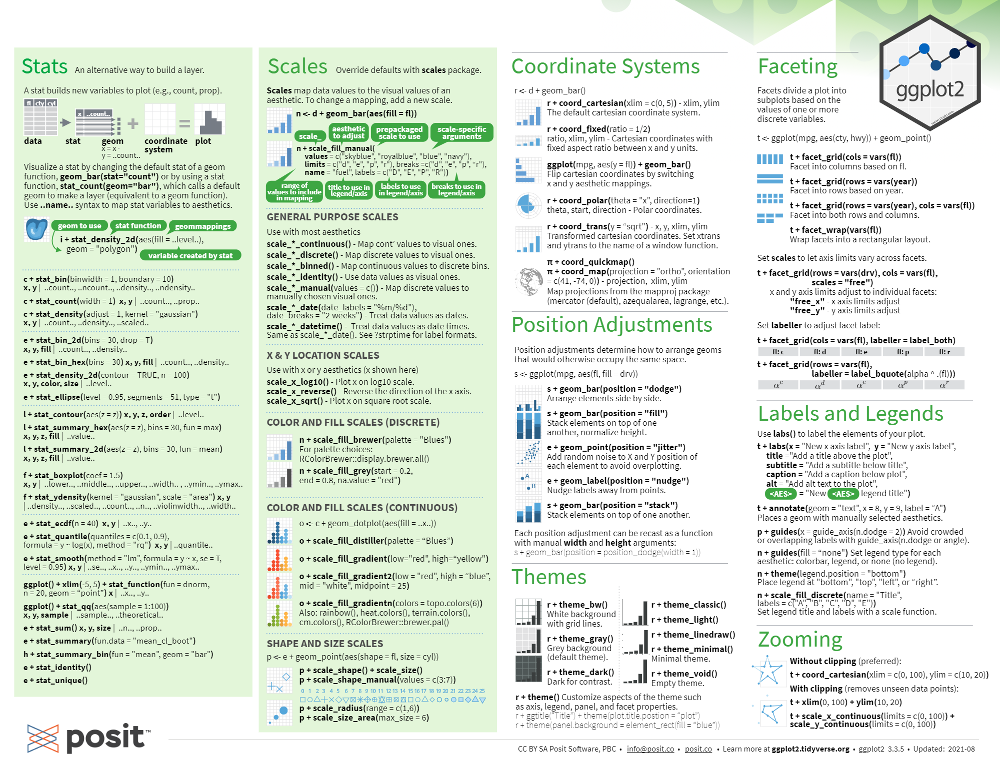
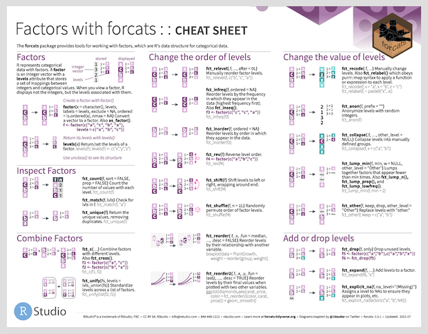
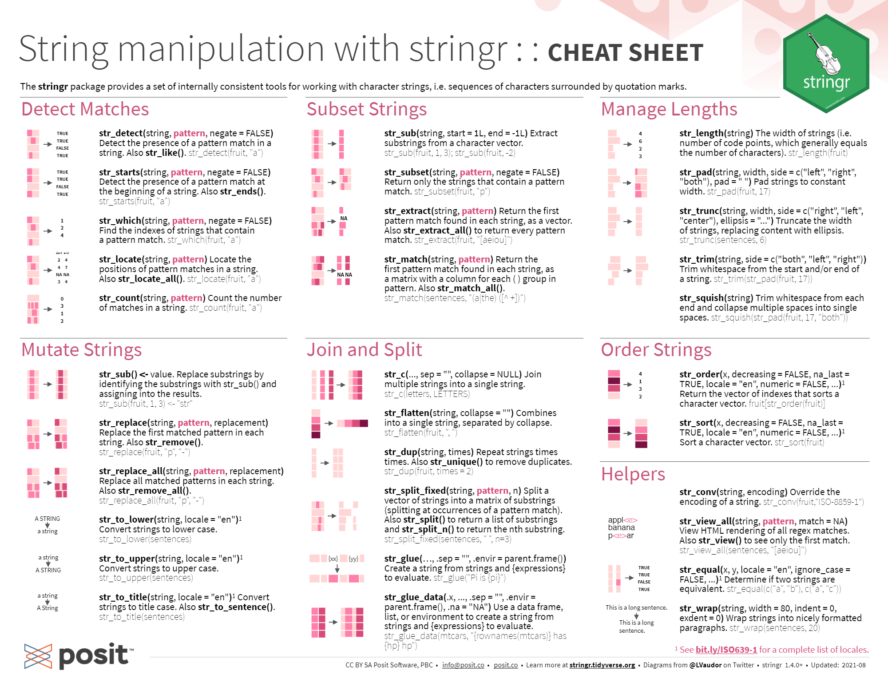
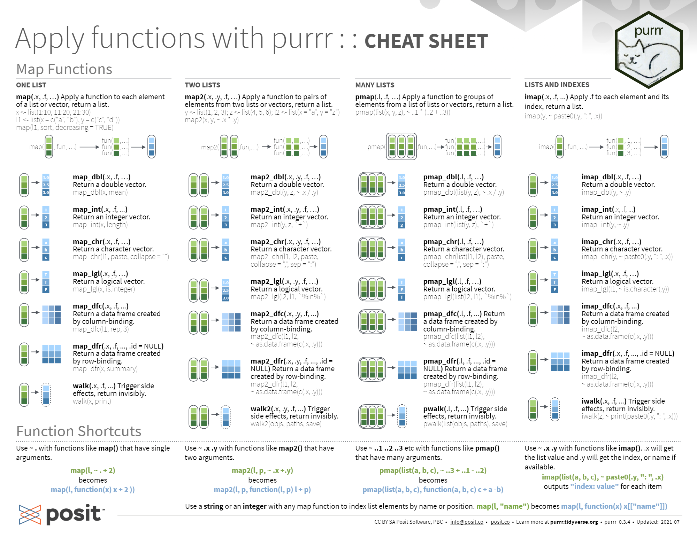

```{r, include=FALSE}
knitr::opts_chunk$set(echo = TRUE)
```

## Introducción a R

R es un lenguaje de programación especializado en análisis y visualización de datos. Es un producto de código abierto, lo cual significa que cualquier persona puede usarlo y modificarlo sin pagar licencias ni costos de adquisición de ningún tipo.

Expertos de todo el mundo colaboran en forma activa con el proyecto, no sólo desarrollando el lenguaje en sí (llamado “R base”), sino también extendiéndolo con nuevas habilidades que pueden ser incorporadas por los usuarios finales en forma de “paquetes” instalables.

La calidad del lenguaje en sí, de los paquetes instalables que le agregan un sinfín de funciones (desde algoritmos de inteligencia artificial hasta mapas interactivos) y de la comunidad de usuarios que comparte información en foros y blogs, ha hecho de R uno de los lenguajes de programación más populares del mundo. En el campo del análisis de datos, es la herramienta por excelencia en muchas universidades, empresas de tecnología, y redacciones de periodismo de datos.

R es un lenguaje creado por y para estadistas, por lo cual presenta muchas facilidades y ventajas en el análisis estadístico de los datos. Presenta gran cantidad de librerías y una comunidad muy activa en áreas del análisis de datos, la inteligencia artificial y sistemas de información geográfica. 


### Paquetes que utilizaremos

Tiddyverse 


```{r}
library(tidyverse)
```


Es *LA LIBRERÍA* para el procesamiento de datos en R. Es una colección de paquetes diseñada para Ciencia de Datos, incluye paquetes de manipulación, procesamiento y visualización de datos. 

Los paquetes incluidos en tidyverse son los siguientes:

- Tidyr una librería para el almacenamiento en el entorno de R y uso de datos en forma de tablas tiddy. Una tabla tiddy cumple la siguiente estructura: *Cada columna es una variable, cada fila es una observación y cada celda es un solo valor*. https://tidyr.tidyverse.org/index.html



- Dplyr es una librería de manipulación de datos en donde *los principales desafíos o necesiadades de manipulación de df se resuelven con simples verbos/funciones* como lo son: mutate(), filter(), select(), summarise(), arrange() y group_by() que puede combinarse con cualquiera de los anteriores.
https://dplyr.tidyverse.org/ 




- Ggplot es una librería para simple para crear gráficos efectivos y claros. Presenta una gran cantidad de herramientas para manipular y personalizar datos. https://ggplot2.tidyverse.org/



- Readr es una herramienta para leer datos rectangulares provenientes de archivos de texto separados por coma "csv", por tabuladores "tsv", por punto y coma como los archivos excel, por espacios en blanco como tablas de datos, entre otros. 
https://readr.tidyverse.org/ 


- Forcats es un paquete para manipular factores y resolver problemas comunes con ellos, los factores son la forma en que R almacena las variables categóricas y variables que tienen un conjunto fijo o conocido de valores posibles. Es muy util en combinación con ggplot para manipular y ordenar variables categóricas utilizadas en por ejemplo gráficos de barras. https://forcats.tidyverse.org/



- Stringr es un paquete para manipular strings, detectando patrones, seleccionando o modificando cadenas. Permite utilizar expreciones regulares para realizar múltiples manipulaciones. https://stringr.tidyverse.org/



- Purr es quizás una de la librerías mas importantes aunque complejas de tidyverse, puesto que permite mejorar el conjunto de herramientas de programación funcional (FP) de R al proporcionar un conjunto completo y consistente de herramientas para trabajar con funciones y vectores. Una de las principales funciones map() permite aplicar funciones a todos los valores de una columna o una lista de columnas. 
https://purrr.tidyverse.org/ 



- Tibble es una nueva forma de almacenar datos modernizando los históricos y tan queridos dataframes. Los Tibbles como dice la documentación son marcos de datos que son perezosos y hoscos: hacen menos (es decir, no cambian los nombres o tipos de variables, y no hacen coincidencias parciales) y se quejan más (por ejemplo, cuando una variable no existe). Lo cual nos sirve para detectar errores más rápidamente y escribir códigos mas limpios y correctos. https://tibble.tidyverse.org/ 


